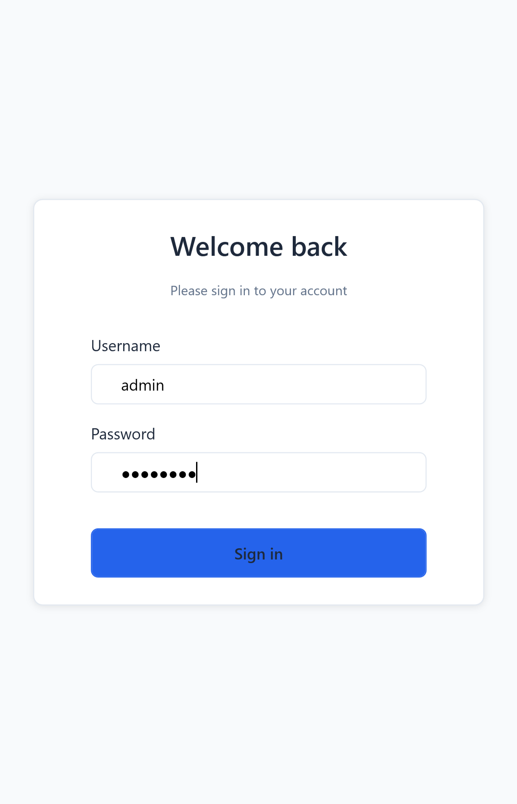
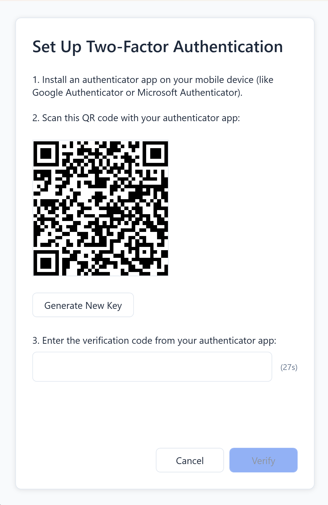
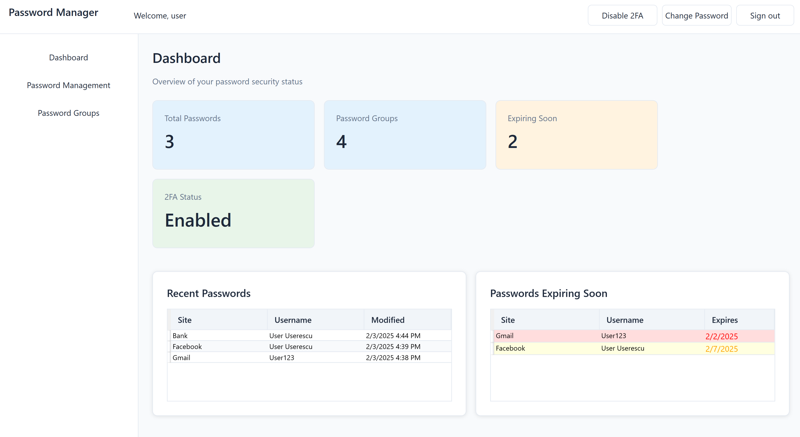
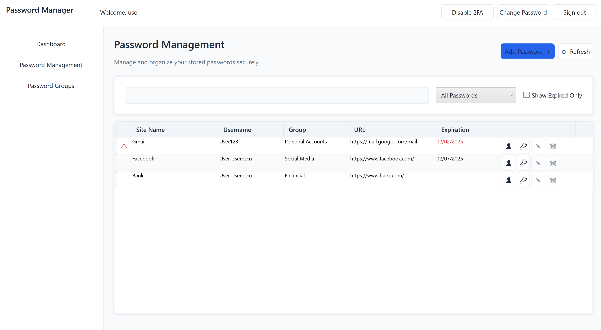
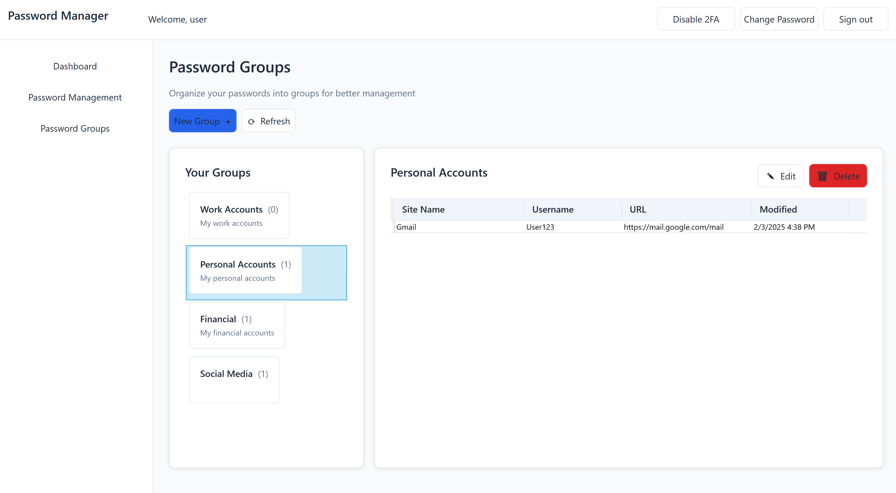
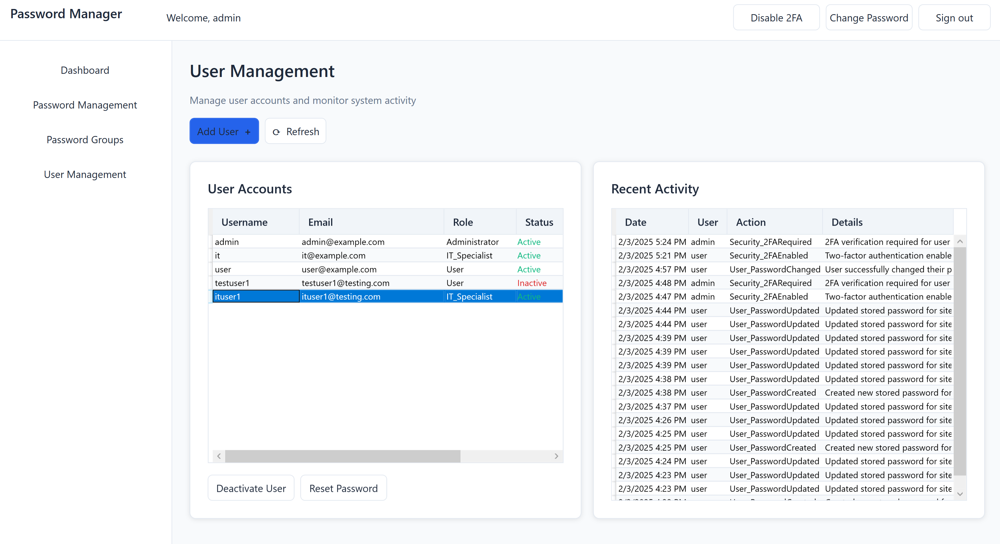
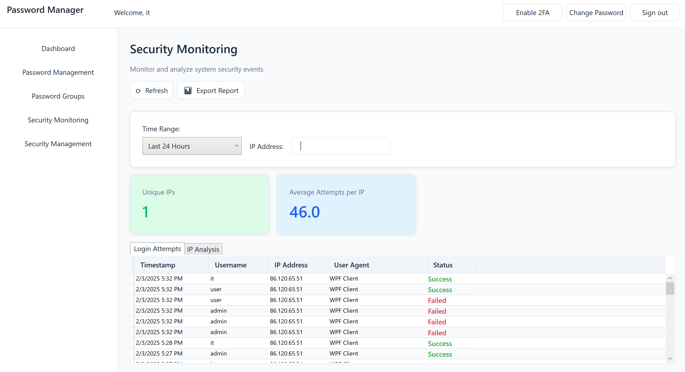
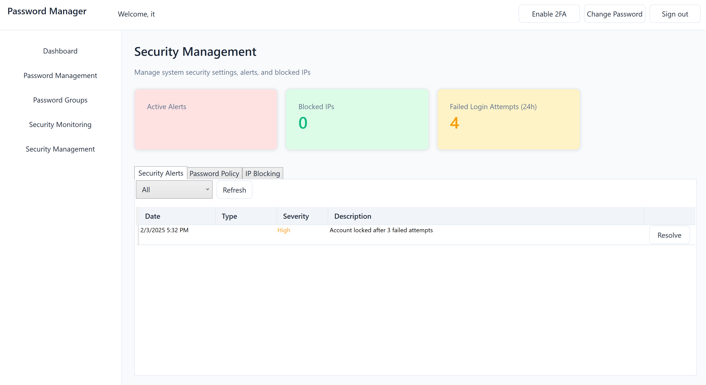
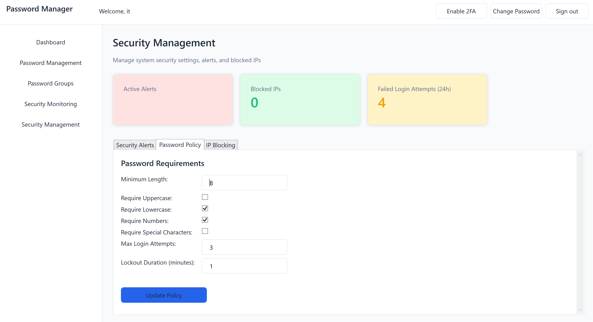
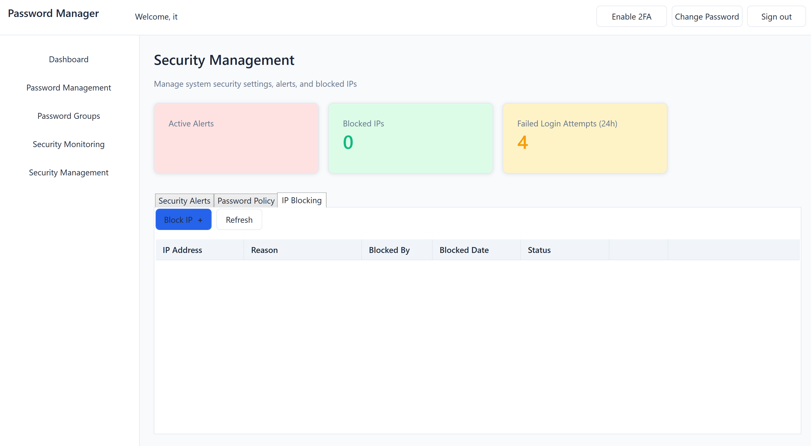

# Password Manager

A secure password management application built with C# and Entity Framework, demonstrating modern software architecture and security best practices.

## Features

### User Management & Authentication
- Role-based access control (User, Administrator, IT Specialist)
- Secure password hashing 
- Two-factor authentication (2FA) using authenticator apps
- Account lockout after failed login attempts
- Session management
- IP-based security monitoring

### Password Management
- Secure storage of website credentials
- Password grouping functionality
- Strong password generation
- Password expiration tracking
- Password strength assessment
- Secure clipboard handling for credentials

### Security Features
- AES-256 encryption for stored passwords
- Password policy enforcement
- Login attempt monitoring
- IP blacklisting
- Security alerts and monitoring
- Audit logging
- Automated security responses

### Administrative Features
- User account management
- Security policy configuration
- System activity monitoring
- Security incident management

### IT Operations
- Security metrics dashboard
- Login attempt analysis
- IP blocking management
- Security alert handling

## Screenshots

### Login & Authentication

<div align="center">
    
    
    *Main login interface*
</div>

<div align="center">
    
    
    *Two-factor authentication setup*
</div>

### Password Management

<div align="center">
    
    
    *User dashboard showing password statistics*
</div>

<div align="center">
    
    
    *Password management interface*
</div>

<div align="center">
    
    
    *Password grouping functionality*
</div>

### Administrative Interface

<div align="center">
    
    
    *Administrative control panel*
</div>

<div align="center">
    
    
    *Security monitoring dashboard*
</div>

<div align="center">
    
    
    *Security monitoring management (1)*
</div>

<div align="center">
    
    
    *Security monitoring management (2)*
</div>

<div align="center">
    
    
    *Security monitoring management (3)*
</div>

## Technologies Used

- **Framework**: .NET Framework 4.8
- **Architecture**: MVVM (Model-View-ViewModel)
- **Database**: Microsoft SQL Server
- **ORM**: Entity Framework 6
- **UI**: WPF (Windows Presentation Foundation)
- **Encryption**: Azure Key Vault for key management
- **2FA**: Time-based One-Time Password (TOTP)

## Architecture

The solution is divided into three main projects:

1. **PasswordManager.Core**
   - Core business logic
   - Service interfaces
   - Models
   - MVVM base classes

2. **PasswordManager.Data**
   - Entity Framework context
   - Database models
   - Repository implementations
   - Data access logic

3. **PasswordManager.App**
   - WPF application
   - Views and ViewModels
   - UI resources
   - User interface logic

## Security Features

### Password Security
- Strong password enforcement
- Regular password expiration
- Password strength assessment
- Secure password generation
- Encrypted storage

### Access Control
- Role-based permissions
- Two-factor authentication
- Account lockout
- Session management
- IP-based security

### Monitoring & Auditing
- Failed login tracking
- Security incident logging
- User activity auditing
- Real-time security alerts

## Installation

1. Clone the repository
2. Open the solution in Visual Studio 2022
3. Update the connection string in `App.config`
4. Run the SQL script in `PasswordManagerEF.sql` to create the database
5. Configure Azure Key Vault credentials in `App.config` (or use local encryption key)
6. Build and run the application

## Default Credentials

```
Administrator:
Username: admin
Password: admin123

IT Specialist:
Username: it
Password: admin123

User:
Username: user
Password: admin123
```

## Development Setup

### Prerequisites
- Visual Studio 2022
- SQL Server Management Studio 2020
- .NET Framework 4.8 SDK
- SQL Server LocalDB or higher

## License

This project is licensed under the MIT License - see the LICENSE file for details

## Contributing

This is an educational project demonstrating various software development concepts. Feel free to fork and modify for your own learning purposes.

## Acknowledgments

- Built as an educational project to demonstrate:
  - MVVM architecture
  - Entity Framework implementation
  - Security best practices
  - WPF development
  - Role-based access control